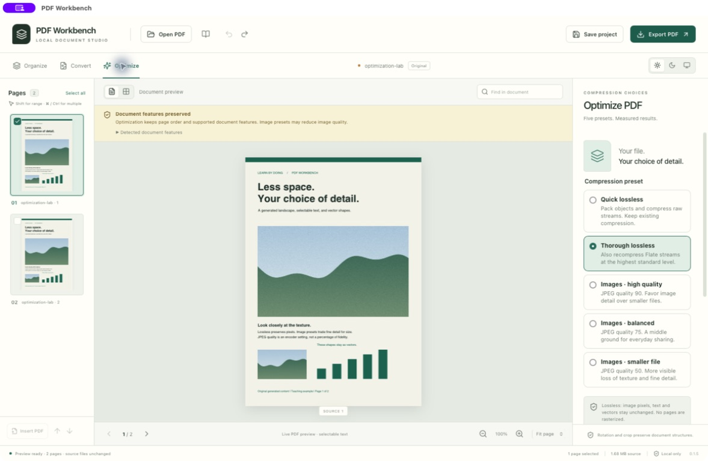

# PDF Workbench

A local desktop studio for arranging PDF pages, adjusting page geometry, and exporting useful copies. Built as an **educational software project** with Tauri, React, TypeScript, PDF.js, qpdf, and pdf-lib.

No account or document upload is needed. PDF processing runs on your computer. Original inputs are preserved, and exports use new filenames.

**Version 0.1.5 · Educational preview · macOS app tested · Windows execution untested**



Also see the [Dark theme screenshot](docs/screenshots/public-0.1.5/dark.jpg).

The screenshots and [teaching samples](examples/README.md) were generated for this project. They contain no private research paper or third-party article. The chart is illustrative; it is not a research result.

## What you can do

| Area | Features |
|---|---|
| Organize | Merge and split PDFs; extract, delete, reorder, duplicate, rotate, and insert pages; insert blank pages. |
| Page geometry | Crop; resize to A4, Letter, A3, Legal, or custom dimensions; choose proportional fit, independent stretching, or page bounds only. |
| Convert | Export pages to PNG/JPEG; turn PNG/JPEG images into PDFs; extract existing selectable text to TXT. |
| Optimize | Five presets: two lossless choices and three JPEG image qualities. Actual byte savings or growth, with no full-page rasterization. |
| Workspace | Large preview, draggable thumbnails and keyboard alternatives, text search, undo/redo, saved projects, explicit session recovery, cancellation, and Light/Dark/System themes. |

Page organization preserves vector page content and selectable text; it does not turn pages into images. PNG/JPEG export is an explicit rendering operation.

Advanced text editing, Office conversion, OCR, redaction, certificate signing, and general public distribution remain on the [roadmap](docs/ROADMAP.md).

## Install the educational preview

Installer files belong in this repository's **Releases** assets when the maintainer uploads them. Download only a build you trust and compare its SHA-256 with the accompanying `SHA256SUMS`. No automatic updater is included.

| Platform | Package | Verification status |
|---|---|---|
| Apple Silicon Mac, macOS 15.4+ | `PDF-Workbench-0.1.5-macOS-arm64.dmg`; optional `.pkg` or app `.zip` | Packaged app opened, transformed, exported, and reopened a generated PDF on macOS. Installer payloads inspected. |
| Windows x64 | `PDF-Workbench-0.1.5-Windows-x64-setup.exe` ([build details](WINDOWS_BUILD.md)) | Windows runtime and installation remain untested. |
| Intel Mac, Windows ARM, Linux | No package supplied | Untested. |

**Mac:** open the DMG, then drag `PDF Workbench.app` into Applications using Finder. Alternatively, use the PKG installer wizard, or extract the app ZIP into a folder you control. Launch the app and choose **Open PDF**. The PKG targets `/Applications` and may ask for administrator permission when you install it; creating the package did not install anything system-wide.

**Signing:** the Mac app is locally ad-hoc signed. The installers are unsigned and are **not Developer ID signed or notarized**. macOS may block a downloaded copy. Do not disable system security to run it. Building from reviewed source is available to developers; Developer ID signing and notarization are planned before general distribution. Windows builds are unsigned and may trigger Windows security prompts.

See [validation](docs/VALIDATION.md) for the distinction between archive checks, application tests, and unperformed installer execution.

## A five-minute learning exercise

1. Download [field-notes.pdf](examples/field-notes.pdf) and open it with **Open PDF**.
2. Select page 1 and choose **Rotate 90°**. Watch the actual page preview update.
3. Try **Undo** and **Redo**. Drag a thumbnail or use **Alt+↑ / Alt+↓** to change its position.
4. Choose **Export PDF**, using a new name such as `my-field-notes.pdf`.
5. Review the export report and choose **Reopen exported PDF**. Compare the file in another viewer.
6. Save a project to learn how source hashes, page identities, and operation settings allow a session to continue later.

For a controlled comparison, [field-notes-rotated.pdf](examples/field-notes-rotated.pdf) is the actual app export with only page 1 rotated. It has four pages; the other three retain their orientation. The [sample notes](examples/README.md) explain the expected result.

This exercise demonstrates the difference between a PDF's content streams, page geometry, and document-level navigation. It also demonstrates why a successful save is only one part of export verification.

## Choose an optimization preset

Open a PDF, select **Optimize** in the left sidebar, choose one of five presets, then **Optimize & export a copy**. Thorough lossless is the default. Your choice is retained in saved projects; ordinary **Export PDF** remains a copy export and does not apply a lossy preference.

| Preset | What changes | When to try it |
|---|---|---|
| Quick lossless | Packs PDF objects and compresses raw streams at Flate level 6; does not request recompression of existing Flate streams. | First pass when preserving exact pixels matters and you want less compression work. |
| Thorough lossless | Also recompresses existing Flate streams at level 9. | Text, diagrams, screenshots, and documents where every image pixel must stay unchanged. |
| Images · high quality | Thorough compression plus eligible image recompression at JPEG quality 90. | Image-heavy PDFs when retaining more fine detail matters. |
| Images · balanced | The same image process at JPEG quality 75. | Everyday sharing after reviewing the result. |
| Images · smaller file | The same image process at JPEG quality 50. | When smaller files matter more than subtle texture or image detail. |

**The three image presets are lossy.** Quality numbers are encoder settings, not percentages of visual fidelity. They retain pixel dimensions and preserve selectable text and vector drawing commands. They do not downsample or rasterize entire pages. Recompressing a scan can affect the legibility of text that is already part of an image. Inspect the exported copy before sharing it.

Eligible image changes are limited to ordinary 8-bit DeviceRGB/DeviceGray image objects larger than 128 pixels in both dimensions and at most 40 megapixels. The pinned engine can recompress existing JPEGs when an explicit quality is supplied. Inline and small images stay unchanged. A changed image with transparency, masks, custom decoding, or an unsupported color format stops that export with a specific explanation and a suggestion to use lossless. Unchanged special images can remain in the PDF. See the [pinned qpdf implementation](https://github.com/qpdf/qpdf/blob/v12.4.1/libqpdf/QPDFJob.cc) for the engine's encoding behavior and [our validation boundary](docs/ARCHITECTURE.md) for the narrower application policy.

There is no guaranteed target size. Each image replacement must reduce that image's encoded data, but shared images can be cloned during the rewrite and total file size can still increase. Already-efficient files may have little to gain. The app reports actual bytes and the number of recompressed image objects; it explicitly reports when no eligible images became smaller. All settings, engine arguments and measurements are included in the local export receipt.

The large preview shows the current input to compression. After exporting, choose **Reopen exported PDF** to inspect the new image quality; use another viewer for an additional check. Choose a different preset on the original document when comparing quality, to avoid repeatedly recompressing an already lossy copy.

### Try the generated Compression Lab

Open [optimization-lab.pdf](examples/optimization-lab.pdf), which contains a generated landscape in lossless and JPEG form, selectable text, vectors, bookmarks and an internal link. The two pages intentionally reuse images. The following are actual native Mac exports from the same 1,757,758-byte input, not predicted savings:

| Preset | Output bytes | Reduction |
|---|---:|---:|
| Quick lossless | 1,547,838 | 11.9% |
| Thorough lossless | 1,516,082 | 13.7% |
| Images · high quality | 1,208,470 | 31.2% |
| Images · balanced | 608,616 | 65.4% |
| Images · smaller file | 314,723 | 82.1% |

Results are specific to this synthetic example. [Measured sizes, timings, preservation checks and image comparisons](docs/results/optimization-0.1.5.json) document the experiment. Both lossless exports had identical independently rendered pixels. Lower image quality visibly smooths the generated texture; it leaves vector labels intact.

## Document fidelity and limitations

PDFs can contain much more than page artwork. The app checks links, bookmarks, annotations, forms, tags, metadata, names, destinations, and other structures before choosing an operation.

- **Eligible structured documents:** full-document rotation, crop, optimization, and export can retain supported structures when page membership and order stay unchanged. Native checks compare the reachable object graph and decoded streams, allowing only the requested changes.
- **Page editing copies:** merge, split, reorder, deletion, extraction, duplication, insertion, and content scaling may require **Enable page editing…**. Review the disclosure before confirming. For eligible inputs, this creates a separate copy that deliberately removes tags, clickable navigation, bookmarks, page labels, document metadata, language/view preferences, and name trees. Visible page content is retained without rasterization. The original is unchanged.
- **Unsupported inputs:** encryption, malformed files, qpdf warnings, interactive forms, signature fields, active scripts, visible annotations, and unknown structures can cause rejection or restricted operations. The app explains the detected limitation; editing-copy conversion is not available for every PDF.
- **Crop is not redaction.** Hidden text and images remain recoverable. Bounds-only resizing can hide or reveal existing content. This release makes no PDF/A, PDF/UA, signature-validity, or universal fidelity claim.
- **Text export is not OCR.** Scanned image pages have no selectable text to extract. Multi-column reading order can differ from the page's visual order.

Current limits: 50 MiB per input/output file, 1,000 pages per project, 100 undo snapshots, 600 DPI and 40 megapixels per exported image, one native job at a time, and a 180-second native job limit. Image EXIF orientation is not applied automatically. Some unusual page coordinate systems and production page boxes are deliberately rejected for geometry changes.

Read the [user guide](docs/USER_GUIDE.md), [preservation architecture](docs/ARCHITECTURE.md), and [project schema](docs/PROJECT_FORMAT.md) before extending an operation. These safeguards are part of the educational purpose: test a concrete preservation claim instead of assuming every PDF is interchangeable.

## Local storage and privacy

An installed app creates its processing workspace lazily under its per-user application data directory:

- macOS: `~/Library/Application Support/local.pdfworkbench.desktop/Workspace`
- Windows: `%LOCALAPPDATA%\local.pdfworkbench.desktop\Workspace`

Developers can set `PDFWORKBENCH_HOME` to an existing absolute workspace containing `.pdfworkbench-workspace`, `tmp`, and `projects`. An explicitly configured workspace that disappears is not replaced by a fallback. The development launcher uses the dedicated project workspace.

Settings and session recovery use standard per-application webview storage. Temporary generated PDFs may be retained for recovery. Saved projects reference original inputs by path and hash and retain generated assets in the workspace's `projects/assets` directory. Keep these assets if you need to reopen a project.

Exports attempt to create a sibling `.recipe.json` receipt recording engine versions, settings, hashes, sizes, and validation results. **Projects and receipts can contain private local paths and filenames. Review them before sharing.** The example files in this repository exclude private receipts, projects, and source history.

On filesystems with the required primitives, output uses an atomic no-clobber commit. On exFAT, an exclusive-create copy fallback is reported; handled failures remove the partial new output, but a power loss may leave a partial new file. Existing files are never silently replaced. A failed batch may leave earlier successful copies, which are reported.

Core use has no telemetry, cloud processing, or account service. The Windows installer may download Microsoft WebView2 if it is missing; initial source builds also download dependencies.

## Build from source on an Apple Silicon Mac

Use an existing dedicated folder with this layout. Clone or extract the **contents of this repository** into `app`:

```text
PDFWorkbench/
  app/                 # this repository: README.md, package.json, src/, src-tauri/
  tools/               # local toolchains, created by setup
  caches/              # Cargo and npm caches
  tmp/                 # processing and build scratch files
  test-data/           # generated validation fixtures
  projects/
  exports/
  releases/
```

Prerequisites: macOS 15.4+, Apple command-line developer tools, Python 3.10+ for validation, and internet access for the first setup. The scripts do not install administrator-level prerequisites. Run these commands from `PDFWorkbench/app`:

```sh
chmod +x scripts/*.sh scripts/*.command scripts/windows-cargo.py
./scripts/setup-macos.sh
python3 -m venv ../tools/validation-python
../tools/validation-python/bin/python -m pip install --cache-dir ../caches/pip -r requirements-validation.txt
../tools/validation-python/bin/python scripts/generate-fixtures.py
../tools/validation-python/bin/python scripts/generate-extra-fixtures.py
./scripts/env.sh npm test
./scripts/env.sh npm run format:check
./scripts/env.sh cargo test --locked --manifest-path src-tauri/Cargo.toml --lib -- --test-threads=1
./scripts/env.sh python3 scripts/archive-notices.py
./scripts/env.sh npm run tauri build -- --bundles app --no-sign
./scripts/env.sh python3 scripts/package-macos.py
./scripts/env.sh python3 scripts/create-macos-installers.py
```

The raw app is in `../caches/target/release/bundle/macos/`; verified release copies and installer checksums are in `../releases/0.1.5/`. Packaging refuses to overwrite an existing release directory. For a subsequent development build, select a new release directory with `package-macos.py --release <name>` or update the application version consistently before making new installers.

For the native development app, run `./scripts/env.sh npm run tauri dev`. The dedicated Vite port is 1420. A browser-only `npm run dev` cannot exercise native file commands. See [WINDOWS_BUILD.md](WINDOWS_BUILD.md) for the separate Windows route.

| Component | Locked version |
|---|---|
| Node / Rust | 24.13.1 / 1.98.1 |
| Tauri Rust / JS API / CLI | 2.11.5 / 2.11.1 / 2.11.4 |
| React / TypeScript / Vite | 19.2.8 / 5.9.3 / 7.3.6 |
| PDF.js / pdf-lib | 6.3.289 / 1.17.1 |
| qpdf / libjpeg-turbo in the Mac sidecar | 12.4.1 / 3.2.0 |

`package-lock.json`, `src-tauri/Cargo.lock`, and `rust-toolchain.toml` pin rebuild inputs. Native source URLs and SHA-256 values are recorded in `scripts/build-native-engine.py`; Windows engine checksums are in `scripts/build-windows.ps1`. SDK and OS differences can affect binary bytes, so bit-for-bit reproducibility is not promised.

## Tests and contributions

The 0.1.5 Mac validation run passed **57 frontend tests, 21 native tests, 236 existing export checks, and 315 additional independent optimization checks using generated fixtures**. The packaged native open → rotate → export → reopen workflow also passed. See [the full validation scope](docs/VALIDATION.md); these results do not establish Windows runtime support or universal PDF fidelity.

Useful educational contributions include a small generated regression PDF, a clear preservation expectation, a test that catches the failure, and a user-facing explanation for unsupported structures. Use synthetic documents in issues and screenshots; do not submit private papers, confidential PDFs, signing keys, or personal project files. See [CONTRIBUTING.md](CONTRIBUTING.md).

## License and third-party components

The application is presented for educational review. **An application redistribution license has not yet been selected.** Educational purpose is not itself a license grant. See [LICENSE-CHOICE.md](LICENSE-CHOICE.md) before reusing or redistributing application code.

Third-party terms remain independent: qpdf and PDF.js use Apache-2.0; pdf-lib uses MIT; additional permissive and file-scoped MPL-2.0 components are included. [Third-party notices](notices/) retain license texts and corresponding MPL source. The packaged Mac app carries them in `Contents/Resources/THIRD-PARTY-NOTICES.zip`. No paid PDF SDK is required.
